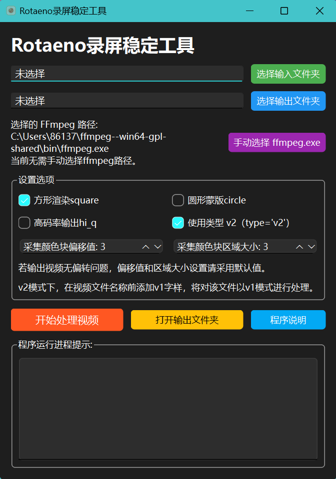

# Python Rotaeno Stabilizer

*Read this in [English](README_EN.md)*


[视频演示](https://www.bilibili.com/video/BV1bc411f7fK/?share_source=copy_web&vd_source=9e94008dbf76e399a164028430118348)

这是一个基于Python的Rotaeno录屏稳定脚本，原理和Rotaeno官方提供的Adobe After
Effects脚本一样，是基于直播模式下录屏画面四个角的颜色来旋转帧，从而达到稳定视频画面的目的。

# 更新记录

## V1.4

- 当前您看到的版本是基于[Lawrenceeeeeeee](https://github.com/Lawrenceeeeeeee/python_rotaeno_stabilizer)的原项目的v1.3版本进行二次开发而来，故在README中保留了原项目的更新记录。
- 当前版本能完全实现原项目`main.py`的脚本功能，可以依照原项目的使用说明使用
- 通过`gui_main`文件实现了图形化界面的支持
- 图形化程序可选输入输出文件夹，具备默认输入输出文件夹选定功能
- 图形化程序支持自动获取同工作目录或用户路径下的`ffmpeg`软件包路径，同时也支持用户手动选择路径
- 增加对圆形蒙版、方形渲染、高码率输出、v1模式等视频处理选项的支持
- 增加对颜色方块取样区域的调整设置，以修复一些机型的录制视频处理失效的问题

## v1.3

- 新增背景圆圈, 优化画面观感
- 修复了脚本在Windows上运行的一些bug
- 修复了长宽比偏小的录屏无法正常添加背景圆圈的问题
- 新增了对于mov, avi, mkv, wmv, flv格式的支持

## v1.2

- 增加多进程优化

## v1.1

- 增加正方形渲染功能（感谢[@Ki-wimon](https://github.com/Ki-wimon)的PR），脚本默认采用正方形渲染，以最大程度减少画面裁切
- 为`convert_vfr_to_cfr`和`add_audio_to_video`函数增加了verbose=False形参，减少命令行输出的冗余
- 删除中间文件，仅保留最后输出

## v1.0

- 增加了V2矫正方法，脚本默认按照V2来稳定视频，如果有V1矫正的需要，请在视频文件名前面添加"v1"
  字样，脚本将自动切换到V1矫正模式进行稳定，例如：`v1-sample.mp4`。

## 功能特点

- 无需安装Adobe After Effects，通过一行命令运行`main.py`即可渲染完成
- 支持批量处理视频
- 图形化程序支持一键式操作，无需部署python运行环境，几乎没有学习成本

## 安装

如果你没有编程能力，直接点击此处 [Releases](https://github.com/weigo6/python_rotaeno_stabilizer/releases) 下载打包好的软件（仅支持Windows），打包的压缩包中已经包含了`ffmpeg`软件包。

程序支持从用户环境和当前的文件夹目录下直接读取`ffmpeg`的路径。所以如果您此前已经在本机安装了`ffmpeg`并将其添加到了用户环境中，则打包的压缩包中的`ffmpeg`软件包是不必要的，可以删去。

双击exe文件即可执行程序，注意不要将ffmpeg软件包的文件夹设置为输出目录。

### 程序开发环境部署

1. 下载项目代码：

```shell
git clone https://github.com/weigo6/python_rotaeno_stabilizer.git
```

或者直接在本仓库界面点击Download ZIP下载然后解压

2. 安装依赖：

```shell
# 切换到脚本所在目录
cd python_rotaeno_stabilizer
# 安装依赖
pip install -r requirements.txt
# 如果需要运行GUI程序，额外安装pyside6，需要执行以下的命令。
pip install pyside6
```

3. 安装FFmpeg

请在[FFmpeg官网](https://ffmpeg.org/download.html)上下载对应的安装包。

## 使用方法

**注意！！！** 录屏前请在Rotaeno的设置中开启"直播模式"，开启后屏幕的四个角将会出现记录设备旋转角的色块。

### 使用批处理脚本

1. 将待处理的视频放在`videos`目录下 (目前支持mp4, mov, avi, mkv, wmv, flv)

2. 启动项目：

```shell
python main.py
```

3. 在`output`文件夹找渲染完成的视频

### 使用图形化界面

1. 启动项目：

```shell
python gui_main.py
```

注：如果没有选择默认的输入输出文件夹的话，则默认选择当前程序所在目录下的`videos`和`output`文件夹，如果`output`文件夹不存在，程序会自动创建。

视频渲染完成后将在程序运行进程提示输出框中返回`Happy End!`字样。



效果如下:


## 联系作者

联系项目原作者：[Bilibili账号](https://space.bilibili.com/143784401)

使用如遇问题可在`Issues`中提问！
