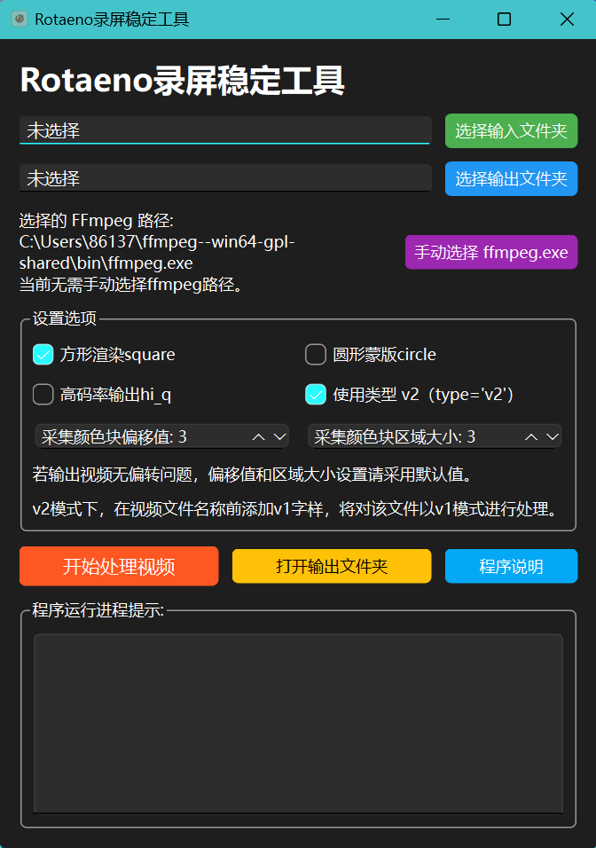

# Python Rotaeno Stabilizer (English README)

*阅读 [中文版](README.md).*


Check out
the [video demonstration](https://www.bilibili.com/video/BV1bc411f7fK/?share_source=copy_web&vd_source=9e94008dbf76e399a164028430118348)

This is a Python-based Rotaeno screen recording stabilization script. Its principle is the same as the script provided
by Rotaeno for Adobe After Effects, which rotates frames based on the colors of the four corners of the screen recording
in live broadcast mode. The goal is to stabilize the video image.

# Update Log

## V1.4

- The current version you see is based on the original project of [Lawrenceeeeeeee](https://github.com/Lawrenceeeeeeee/python_rotaeno_stabilizer)'s v1.3 version of the secondary development, so in the README to keep the original project update records.
- The current version can fully realise the script function of the original project main.py, you can use it according to the instructions of the original project.
- GUI support through `gui_main.py` file.
- The graphical application can select input and output folders, and has the function of selecting the default input and output folders.
- The graphical application supports automatically obtaining the path of ffmpeg packages in the same working directory or user path, and also supports the user to manually select the path.
- Add support for video processing options such as circular masking, square rendering, high bitrate output, v1 mode, etc.
- Add settings for adjusting the sampling area of colour squares to fix the problem of recording video processing failure in some models.

## v1.3

- Added background circle, optimized visual experience
- Fixed some bugs when the script runs on Windows
- Fixed the issue where the background circle could not be properly added to screen recordings with a small width-height ratio.
- Added support for mov, avi, mkv, wmv, flv formats

## v1.2

- Added multi-process optimization.

## v1.1

- Added square rendering feature (thanks to the PR by [@Ki-wimon](https://github.com/Ki-wimon)). The script now defaults
  to square rendering to minimize cropping of the frame.
- Added a `verbose=False` parameter to the `convert_vfr_to_cfr` and `add_audio_to_video` functions to reduce redundant
  command line output.
- Deleted intermediate files, keeping only the final output.

## v1.0

- Added the V2 correction method. The script now defaults to stabilizing videos using V2. If V1 correction is needed,
  please add "v1" at the beginning of the video filename. The script will automatically switch to V1 correction mode for
  stabilization, e.g., `v1-sample.mp4`.

## Features

- No need to install Adobe After Effects; rendering can be done with just one command.
- Supports batch processing of videos.

## Installation

If you don't have programming skills, just click here [Releases](https://github.com/weigo6/python_rotaeno_stabilizer/releases) to download the packaged software (Windows only), the packaged zip already contains the `ffmpeg`package.

The program supports reading the path to `ffmpeg` directly from the user's environment and the current folder directory.So if you have already installed `ffmpeg` locally and added it to the user's environment, the `ffmpeg` package in the packaged zip is not necessary and can be deleted.

Double-click the exe file to execute the program, be careful not to set the folder of the ffmpeg package as the output directory.

### Deployment of the programme development environment

1. Download the project code:

```shell
git clone https://github.com/weigo6/python_rotaeno_stabilizer.git
```

Alternatively, you can directly click "Download ZIP" on this repository page, then unzip the downloaded file.

2. Install the dependencies:

```shell
# Navigate to the directory containing the script
cd python_rotaeno_stabilizer
pip install -r requirements.txt
# If you need to run the GUI programme, additionally install pyside6, you need to execute the following commands.
pip install pyside6
```

3. Install FFmpeg

Please download the appropriate installation package from
the [FFmpeg official website](https://ffmpeg.org/download.html).

## How to Use

**Note!!!** Before recording the screen, please enable "Live Mode" in Rotaeno's settings, after enabling it, the four corners of the screen will appear to record the rotation angle of the device's colour block.

### Using batch scripts

1. Place the video to be processed in the videos directory (currently supports mp4, mov, avi, mkv, wmv, flv).

2. Start the project:

```shell
python main.py
```

3. Once processing is complete, find the rendered videos in the `output` folder.

### Using the graphical interface

1. Launching the project:

```shell
python gui_main.py
```

Note: If you don't choose the default input/output folder, the default folder will be the videos and output folder in the current directory of the program, if the output folder doesn't exist, the program will create it automatically.

When the video rendering is complete, the Happy End! text will be returned in the program's runtime prompt output box.



Result as follows:


You can ask questions in Issues if you have problems with use!
